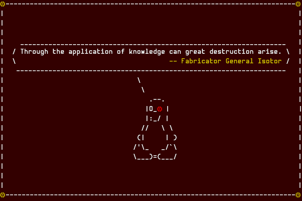

<!--
SPDX-FileCopyrightText: 2023 Jason Pena <jasonpena@awkless.com>
SPDX-License-Identifier: MIT
-->

# Awklesses' GitHub Profile

  

  
  

## About Me

I am an aspiring, self-taught software developer and systems administrator with
a deep passion for exploring and optimizing computer systems. As an adaptable
critical thinker, I am consistently eager to stay at the forefront of emerging
technologies. I possess a strong foundation in software project design and
management, combined with practical experience in delivering innovative
solutions. In my spare time, I design and develop emulators and general-purpose
tools for system administration, further enhancing my technical expertise.

## Statistics

> __WARNING__: The following stats only show my activity on GitHub, which is not
> accurate to my full activity across the forges mailing lists I use.

> __NOTE__: See my sourcehut account, or the toybox mailing list archive for
> more of the stuff I have been doing.

  Vistor count 
  

  

  

